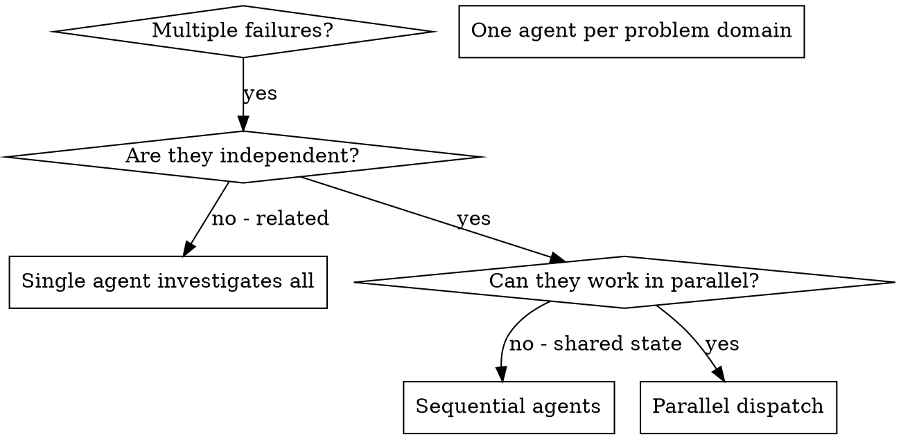

# Dispatching Parallel Agents

## Overview

You delegate tasks to specialized agents with isolated context. By precisely crafting their instructions and context, you ensure they stay focused and succeed at their task. They should never inherit your session's context or history - you construct exactly what they need. This also preserves your own context for coordination work.

When you have multiple unrelated failures (different test files, different subsystems, different bugs), investigating them sequentially wastes time. Each investigation is independent and can happen in parallel.

__Core principle:__ Dispatch one agent per independent problem domain. Let them work concurrently.

## Cline Compatibility

Use this skill only when the active Cline host exposes subagent support. If subagents are unavailable, investigate the independent domains sequentially and keep the task list explicit.

## When to Use



__Use when:__
- 3+ test files failing with different root causes
- Multiple subsystems broken independently
- Each problem can be understood without context from others
- No shared state between investigations

__Don't use when:__
- Failures are related (fix one might fix others)
- Need to understand full system state
- Agents would interfere with each other

## The Pattern

### 1. Identify Independent Domains

Group failures by what's broken:
- File A tests: Tool approval flow
- File B tests: Batch completion behavior
- File C tests: Abort functionality

Each domain is independent - fixing tool approval doesn't affect abort tests.

### 2. Create Focused Agent Tasks

Each agent gets:
- __Specific scope:__ One test file or subsystem
- __Clear goal:__ Make these tests pass
- __Constraints:__ Don't change other code
- __Expected output:__ Summary of what you found and fixed

### 3. Dispatch in Parallel

```typescript
// In Claude Code / AI environment
Task("Fix agent-tool-abort.test.ts failures")
Task("Fix batch-completion-behavior.test.ts failures")
Task("Fix tool-approval-race-conditions.test.ts failures")
// All three run concurrently
```

### 4. Review and Integrate

When agents return:
- Read each summary
- Verify fixes don't conflict
- Run full test suite
- Integrate all changes

## Agent Prompt Structure

Good agent prompts are:
1. __Focused__ - One clear problem domain
2. __Self-contained__ - All context needed to understand the problem
3. __Specific about output__ - What should the agent return?

```markdown
Fix the 3 failing tests in src/agents/agent-tool-abort.test.ts:

1. "should abort tool with partial output capture" - expects 'interrupted at' in message
2. "should handle mixed completed and aborted tools" - fast tool aborted instead of completed
3. "should properly track pendingToolCount" - expects 3 results but gets 0

These are timing/race condition issues. Your task:

1. Read the test file and understand what each test verifies
2. Identify root cause - timing issues or actual bugs?
3. Fix by:
   - Replacing arbitrary timeouts with event-based waiting
   - Fixing bugs in abort implementation if found
   - Adjusting test expectations if testing changed behavior

Do NOT just increase timeouts - find the real issue.

Return: Summary of what you found and what you fixed.
```

## Common Mistakes

__❌ Too broad:__ "Fix all the tests" - agent gets lost
__✅ Specific:__ "Fix agent-tool-abort.test.ts" - focused scope

__❌ No context:__ "Fix the race condition" - agent doesn't know where
__✅ Context:__ Paste the error messages and test names

__❌ No constraints:__ Agent might refactor everything
__✅ Constraints:__ "Do NOT change production code" or "Fix tests only"

__❌ Vague output:__ "Fix it" - you don't know what changed
__✅ Specific:__ "Return summary of root cause and changes"

## When NOT to Use

__Related failures:__ Fixing one might fix others - investigate together first
__Need full context:__ Understanding requires seeing entire system
__Exploratory debugging:__ You don't know what's broken yet
__Shared state:__ Agents would interfere (editing same files, using same resources)

## Real Example from Session

__Scenario:__ 6 test failures across 3 files after major refactoring

__Failures:__
- agent-tool-abort.test.ts: 3 failures (timing issues)
- batch-completion-behavior.test.ts: 2 failures (tools not executing)
- tool-approval-race-conditions.test.ts: 1 failure (execution count = 0)

__Decision:__ Independent domains - abort logic separate from batch completion separate from race conditions

__Dispatch:__
```
Agent 1 → Fix agent-tool-abort.test.ts
Agent 2 → Fix batch-completion-behavior.test.ts
Agent 3 → Fix tool-approval-race-conditions.test.ts
```

__Results:__
- Agent 1: Replaced timeouts with event-based waiting
- Agent 2: Fixed event structure bug (threadId in wrong place)
- Agent 3: Added wait for async tool execution to complete

__Integration:__ All fixes independent, no conflicts, full suite green

__Time saved:__ 3 problems solved in parallel vs sequentially

## Key Benefits

1. __Parallelization__ - Multiple investigations happen simultaneously
2. __Focus__ - Each agent has narrow scope, less context to track
3. __Independence__ - Agents don't interfere with each other
4. __Speed__ - 3 problems solved in time of 1

## Verification

After agents return:
1. __Review each summary__ - Understand what changed
2. __Check for conflicts__ - Did agents edit same code?
3. __Run full suite__ - Verify all fixes work together
4. __Spot check__ - Agents can make systematic errors

## Real-World Impact

From debugging session (2025-10-03):
- 6 failures across 3 files
- 3 agents dispatched in parallel
- All investigations completed concurrently
- All fixes integrated successfully
- Zero conflicts between agent changes
