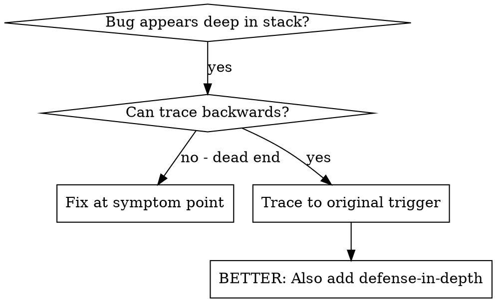
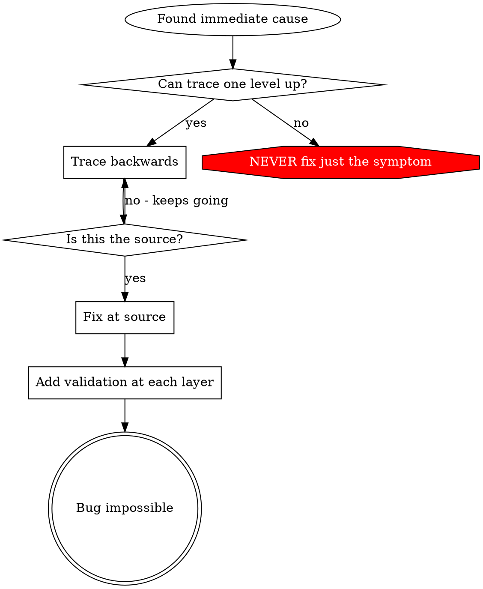

# Root Cause Tracing

## Overview

Bugs often manifest deep in the call stack (git init in wrong directory, file created in wrong location, database opened with wrong path). Your instinct is to fix where the error appears, but that's treating a symptom.

__Core principle:__ Trace backward through the call chain until you find the original trigger, then fix at the source.

## When to Use



__Use when:__
- Error happens deep in execution (not at entry point)
- Stack trace shows long call chain
- Unclear where invalid data originated
- Need to find which test/code triggers the problem

## The Tracing Process

### 1. Observe the Symptom
```
Error: git init failed in ~/project/packages/core
```

### 2. Find Immediate Cause
__What code directly causes this?__
```typescript
await execFileAsync('git', ['init'], { cwd: projectDir });
```

### 3. Ask: What Called This?
```typescript
WorktreeManager.createSessionWorktree(projectDir, sessionId)
  → called by Session.initializeWorkspace()
  → called by Session.create()
  → called by test at Project.create()
```

### 4. Keep Tracing Up
__What value was passed?__
- `projectDir = ''` (empty string!)
- Empty string as `cwd` resolves to `process.cwd()`
- That's the source code directory!

### 5. Find Original Trigger
__Where did empty string come from?__
```typescript
const context = setupCoreTest(); // Returns { tempDir: '' }
Project.create('name', context.tempDir); // Accessed before beforeEach!
```

## Adding Stack Traces

When you can't trace manually, add instrumentation:

```typescript
// Before the problematic operation
async function gitInit(directory: string) {
  const stack = new Error().stack;
  console.error('DEBUG git init:', {
    directory,
    cwd: process.cwd(),
    nodeEnv: process.env.NODE_ENV,
    stack,
  });

  await execFileAsync('git', ['init'], { cwd: directory });
}
```

__Critical:__ Use `console.error()` in tests (not logger - may not show)

__Run and capture:__
```bash
npm test 2>&1 | grep 'DEBUG git init'
```

__Analyze stack traces:__
- Look for test file names
- Find the line number triggering the call
- Identify the pattern (same test? same parameter?)

## Finding Which Test Causes Pollution

If something appears during tests but you don't know which test:

Use the bisection script `find-polluter.sh` in this directory:

```bash
./find-polluter.sh '.git' 'src/**/*.test.ts'
```

Runs tests one-by-one, stops at first polluter. See script for usage.

## Real Example: Empty projectDir

__Symptom:__ `.git` created in `packages/core/` (source code)

__Trace chain:__
1. `git init` runs in `process.cwd()` ← empty cwd parameter
2. WorktreeManager called with empty projectDir
3. Session.create() passed empty string
4. Test accessed `context.tempDir` before beforeEach
5. setupCoreTest() returns `{ tempDir: '' }` initially

__Root cause:__ Top-level variable initialization accessing empty value

__Fix:__ Made tempDir a getter that throws if accessed before beforeEach

__Also added defense-in-depth:__
- Layer 1: Project.create() validates directory
- Layer 2: WorkspaceManager validates not empty
- Layer 3: NODE_ENV guard refuses git init outside tmpdir
- Layer 4: Stack trace logging before git init

## Key Principle



__NEVER fix just where the error appears.__ Trace back to find the original trigger.

## Stack Trace Tips

__In tests:__ Use `console.error()` not logger - logger may be suppressed
__Before operation:__ Log before the dangerous operation, not after it fails
__Include context:__ Directory, cwd, environment variables, timestamps
__Capture stack:__ `new Error().stack` shows complete call chain

## Real-World Impact

From debugging session (2025-10-03):
- Found root cause through 5-level trace
- Fixed at source (getter validation)
- Added 4 layers of defense
- 1847 tests passed, zero pollution
