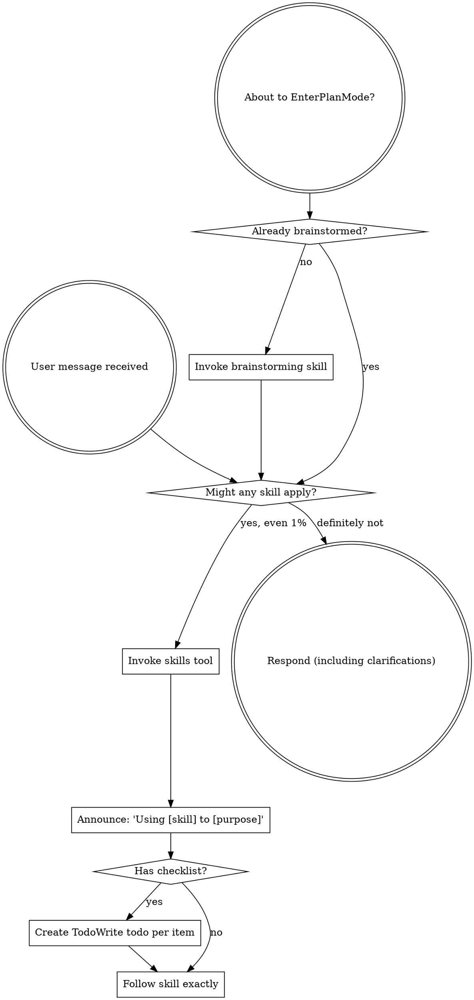

<SUBAGENT-STOP>
If you were dispatched as a subagent to execute a specific task, skip this skill.
</SUBAGENT-STOP>

<EXTREMELY-IMPORTANT>
If you think there is even a 1% chance a skill might apply to what you are doing, you ABSOLUTELY MUST invoke the skill.

IF A SKILL APPLIES TO YOUR TASK, YOU DO NOT HAVE A CHOICE. YOU MUST USE IT.

This is not negotiable. This is not optional. You cannot rationalize your way out of this.
</EXTREMELY-IMPORTANT>

## Instruction Priority

Superpowers skills override default system prompt behavior, but __user instructions always take precedence__:

1. __User's explicit instructions__ (CLAUDE.md, GEMINI.md, AGENTS.md, direct requests) - highest priority
2. __Superpowers skills__ - override default system behavior where they conflict
3. __Default system prompt__ - lowest priority

If CLAUDE.md, GEMINI.md, or AGENTS.md says "don't use TDD" and a skill says "always use TDD," follow the user's instructions. The user is in control.

## How to Access Skills

__In Cline:__ Use the `skills` tool. Invoke Superpowers skills by their full names, such as `superpowers:brainstorming`, or by the bare skill name when it is unambiguous.

__In Claude Code:__ Use the `Skill` tool. When you invoke a skill, its content is loaded and presented to you-follow it directly. Never use the Read tool on skill files.

__In Copilot CLI:__ Use the `skill` tool. Skills are auto-discovered from installed plugins. The `skill` tool works the same as Claude Code's `Skill` tool.

__In Gemini CLI:__ Skills activate via the `activate_skill` tool. Gemini loads skill metadata at session start and activates the full content on demand.

__In other environments:__ Check your platform's documentation for how skills are loaded.

## Platform Adaptation

Skills may use Claude Code tool names. In Cline, see `references/cline-tools.md` for equivalents. Other platforms: see `references/copilot-tools.md` (Copilot CLI), `references/codex-tools.md` (Codex) for tool equivalents. Gemini CLI users get the tool mapping loaded automatically via GEMINI.md.

# Using Skills

## The Rule

__Invoke relevant or requested skills BEFORE any response or action.__ Even a 1% chance a skill might apply means that you should invoke the skill to check. If an invoked skill turns out to be wrong for the situation, you don't need to use it.

## Red Flags

These thoughts mean STOP-you're rationalizing:

| Thought | Reality |
|---------|---------|
| "This is just a simple question" | Questions are tasks. Check for skills. |
| "I need more context first" | Skill check comes BEFORE clarifying questions. |
| "Let me explore the codebase first" | Skills tell you HOW to explore. Check first. |
| "I can check git/files quickly" | Files lack conversation context. Check for skills. |
| "Let me gather information first" | Skills tell you HOW to gather information. |
| "This doesn't need a formal skill" | If a skill exists, use it. |
| "I remember this skill" | Skills evolve. Read current version. |
| "This doesn't count as a task" | Action = task. Check for skills. |
| "The skill is overkill" | Simple things become complex. Use it. |
| "I'll just do this one thing first" | Check BEFORE doing anything. |
| "This feels productive" | Undisciplined action wastes time. Skills prevent this. |
| "I know what that means" | Knowing the concept ≠ using the skill. Invoke it. |

## Skill Priority

When multiple skills could apply, use this order:

1. __Process skills first__ (brainstorming, debugging) - these determine HOW to approach the task
2. __Implementation skills second__ (frontend-design, mcp-builder) - these guide execution

"Let's build X" → brainstorming first, then implementation skills.
"Fix this bug" → debugging first, then domain-specific skills.

## Skill Types

__Rigid__ (TDD, debugging): Follow exactly. Don't adapt away discipline.

__Flexible__ (patterns): Adapt principles to context.

The skill itself tells you which.

## User Instructions

Instructions say WHAT, not HOW. "Add X" or "Fix Y" doesn't mean skip workflows.
